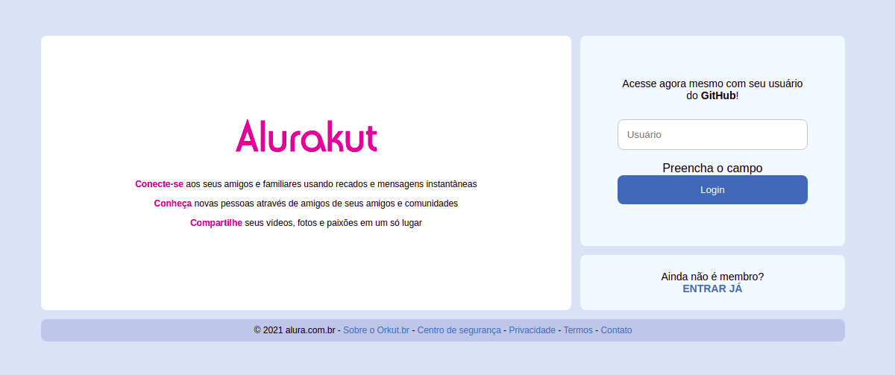
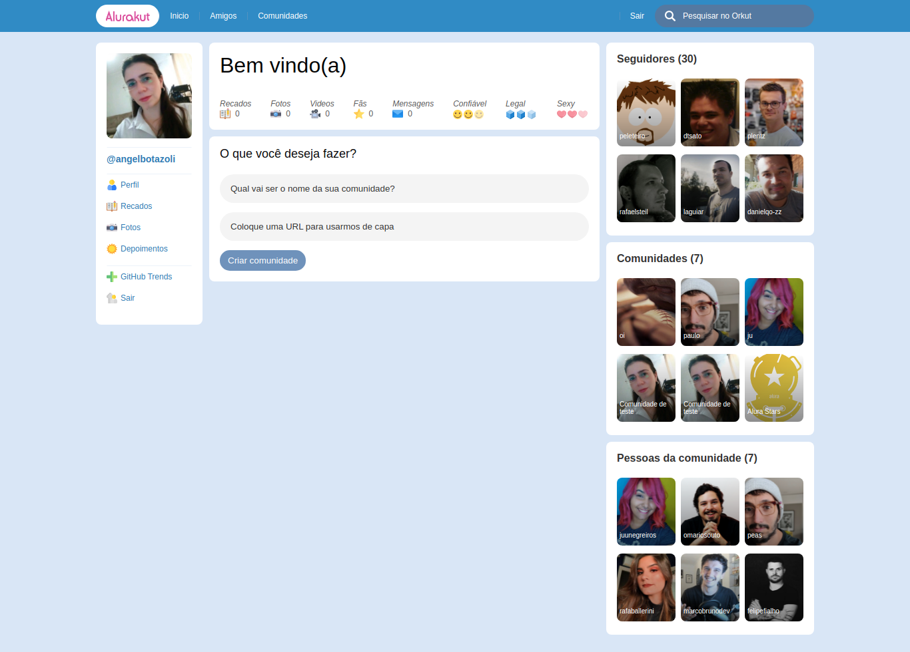

<h1 align="center">
   Alurakut
</h1>

<p align="center">
  <a href="#-tecnologias">Tecnologias</a>&nbsp;&nbsp;&nbsp;|&nbsp;&nbsp;&nbsp;
  <a href="#-projeto">Projeto</a>&nbsp;&nbsp;&nbsp;|&nbsp;&nbsp;&nbsp;
  <a href="#-como-executar">Como executar</a>&nbsp;&nbsp;&nbsp;|&nbsp;&nbsp;&nbsp;
  <a href="#-deply">Deploy</a>
</p>

<p align="center">
  
  
</p>

## 🔧 Tecnologias 

Esse projeto foi desenvolvido com as seguintes tecnologias:

- React
- Next.js
- DatoCMS

## 🚀 Como executar

Clone o projeto e acesse a pasta do mesmo.

```bash
$ git clone https://github.com/angelbotazoli/alurakut.git
$ cd alurakut
```

Para iniciá-lo, siga os passos abaixo:
```bash
# Baixar as dependências
$ npm i

# Alterar a chamada da API de autenticação dentro do arquivo index.js
$ cd pages/index.js
$ na linha 265, alterar https://alurakut-nu-dun.vercel.app/api/auth por http://localhost:3000/api/auth

# Iniciar o projeto
$ npm start
```

## :arrow_forward:  Deploy

[Alurakut](https://alurakut-nu-dun.vercel.app)

## 💻 Projeto

O Alurakut é uma replica do Orkut, sendo possível logar com sua conta github e adicionar comunidades e realizar logout.

<br>

---
Desenvolvido durante [imersaoReact](https://www.alura.com.br/imersao-react)
